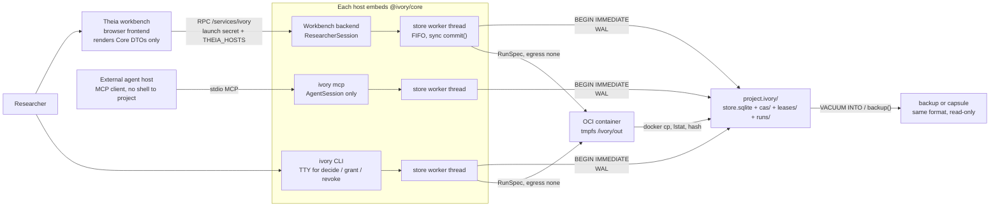
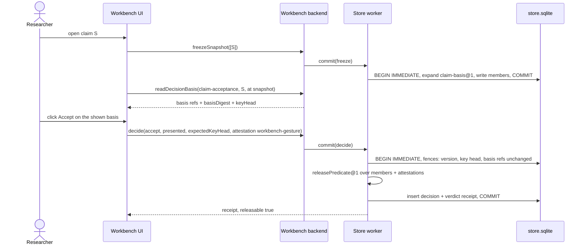
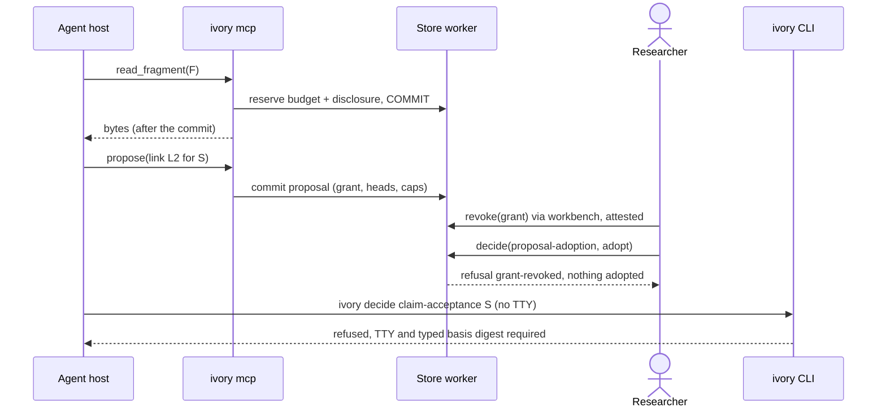

# Ivory V5.0 architecture decision package

> Rendered as Markdown from the Notion page [Ivory V5.0 Architecture](https://app.notion.com/p/3e99cb079ddb8105aaabfa282dcda257), last edited 2026-09-29 02:25 UTC. The text is unedited; only the markup is converted. The Notion attachments (the four candidate write-ups, the four interrogation reviews and the probe scripts) are not retained in this repository. §21 records their dispositions at cluster level.

**Status:** Architecture baseline **accepted for scaffolding** after a four-way independent architect arena and a four-way independent interrogation. V5.0 **release** qualification is **not met**; see §15.
**Date:** 2026-09-28 · **Owner:** Michael Berry · **Decision records to file:** ADR-009 (V5 topology), ADR-010 (typed decision seam omitted from V5.0)
**Supersedes as target:** [Notion page](https://app.notion.com/p/3dd9cb079ddb80f49717e9d75ea2e223) (historical, not rewritten)
**Completes:** [Notion page](https://app.notion.com/p/3e49cb079ddb81ba963be6c91d9a4765) §§6–8 (architecture arena, interrogation, decision package)
**Process standard:** [Notion page](https://app.notion.com/p/3dd9cb079ddb819dbc41c3f1c08dd88a) · **Seam evidence:** [Notion page](https://app.notion.com/p/3e49cb079ddb801db7ddda66ae715eaa)
**Code base:** `mberrys/ivory@dev` = `8b94967c4` (Theia 1.76.0). Reset branch `integration/ivory-v5-reset-archive` @ `3189d26fc` (based on `b0f9e63a6`). Archive source `mberrys/ivory-archive@dev` = `bfcb283c4`.
> 🧭 **V5.0 decision.** Ivory V5.0 is a local-first, single-researcher evidence workbench whose only canonical authority is **one framework-free Core library over one self-describing project directory** (an SQLite store plus a content-addressed blob store). The Theia workbench backend, the `ivory` CLI and a proposal-only MCP agent server each embed the same library, run its store in a dedicated worker thread, and write only through one `commit()` path. Mechanical checks are computed by Core; semantic support and claim acceptance are **attested researcher decisions**; agents only propose. The Jev-like typed decision seam is **omitted from the V5.0 runtime** with a reserved, schema-free re-entry path. The project-directory format is also the backup and the research capsule.

> ⚠️ This page is a **design decision**, not a test result. Every gate in §15 stays open until its own retained evidence record exists. Slice 1 (§15.3) is a deliberate bake-off: if it fails, Core keeps the same API and moves into a single host process over PGlite (the shape candidates A/B/C designed).

## 0. Review of the reset plan and branch
Findings from reviewing the reset page, `integration/ivory-v5-reset-archive`, the newer Ivory branches and CI (verified 2026-09-27/28).

| # | Finding | Evidence | Disposition |
| --- | --- | --- | --- |
| R-1 | R0 clean baseline **passed**, but the branch docs still say pending. | Actions run 35935375013: `npm ci` (2079 packages), `lerna run compile` (94 projects), browser, browser-only and electron bundles, all green on ubuntu-22.04 / Node 24. `baseline-verification.md` and `v5-qualification.md` still say “pending”. | Correct the docs in slice 0. R0 clean-baseline is Linux-runner scoped. |
| R-2 | Wrong destination branch; destination moved. | The reset page names `master`. `master` mirrors upstream Theia and Ivory PRs go to `dev`. Both are now `8b94967c4` (20 commits after `b0f9e63a6`). | Rebase the reset branch onto `dev`; all V5 PRs target `dev`. |
| R-3 | Three Ivory branches are outside the reset ledger. | `experiment/jev-r2-r3-semantic-seam` (R2–R5 results), `feat/ivory-contracts` (`@ivory/contracts`: ExactRef, semanticClosure, RFC 8785 digest, Python twin), `feat/ivory-poteto-gui` (`@theia/ivory-gui` prototype). | Contracts: adopt into `dev` first. GUI: rewrite (it predates a stable Core seam, a reset hard stop, and owns a UI status union). Experiment branch: reference only. |
| R-4 | The reset seam code has three authority-shaped defects. | Probed: ties and near-uniform distributions return `answered`; the adapter self-declares `remote`, so a remote adapter claiming local reads `local-only` data; any async adapter returns `invalid`. It also carries a second, non-RFC-8785 digest. | Moot for V5.0 (seam omitted, §10). The fixes are written into the re-entry contract. |
| R-5 | The dependency queue contains a loop. | J7–J9 need a selected, durable Core, but the plan places them before the V5.0 decision that selects the Core. | Split: this page is the **architecture baseline decision**; the **V5.0 release** is a separate predicate (§15.4). |
| R-6 | The experiment program was aimed almost entirely at the seam. | J1–J9 all concern the typed decision seam. Store, process, Theia security and display fidelity had no experiments, and interrogation found real defects in each (event-loop stall, cookie-issued researcher authority, BOM/EOL citation drift). | J-program re-scoped in §15.2; slice 1 now targets the risks that can actually fail. |
| R-7 | The provisional `DecisionRequest` was under-bound. | No grant or expected heads, no digest of the bytes actually transmitted, no calibration reference, no async/abort contract. | Superseded by the omission decision; the re-entry schema in §10 carries these fields. |
| R-9 | **The evidence repository is unreachable.** | Since 2026-09-29, `mberrys/ivory-archive` returns 404 to both GitHub Actions and the owner's `gh` login. It is not listed under `mberrys`, and no local clone holds `bfcb283c4`. The `archive-and-boundaries` CI job now fails at checkout (run 36507823752). In the repo, only the 10 verbatim imports in `docs/archive-evidence/` survive. The other pinned N-records and 335 source blobs are referenced by SHA only. | **Resolved 2026-09-29.** All 10 pinned heads were recovered by SHA from the GitHub fork network and re-homed in `mberrys/ivory`:<br>  • protected tags `archive/ivory-archive/*` (ruleset `archive-evidence-tags`: no deletion or update, no bypass);<br>  • a git bundle on the [archive release](https://github.com/mberrys/ivory/releases/tag/archive/ivory-archive/dev) (SHA-256 `a5b752a3…20559a1`).<br>Verified: 335/335 dev blobs, 72/72 branch-only blobs, 10/10 trees, and all 10 imported copies byte-identical. Every pinned SHA is unchanged. CI now checks out `mberrys/ivory@bfcb283c4` (commit `a9a630712`), and the manifest carries a `relocation` record. |
| R-8 | Deliverable sprawl. | The reset plan asks for eight separate documents before the first Core slice. | This page is the decision package. The repository gets ADR-009, ADR-010 and one qualification ledger; nothing else is required before slice 1. |


## 1. Decision record

| # | Decision | Source | Reverse if |
| --- | --- | --- | --- |
| D1 | **Core is a framework-free library** (`@ivory/core`) with typed `ResearcherSession` / `AgentSession` / `ReaderSession` and one `commit()`. Each host (workbench backend, CLI, MCP server) runs the store in **one dedicated worker thread** that owns the write connection and serves a FIFO queue. Commit handlers are synchronous by type: no `await` between `BEGIN` and `COMMIT`. | D (library), A/B/C (catalog, session typing), all four reviewers (worker thread) | Slice 1 misses the host-latency or lease criteria, or a non-Node writer is required → wrap the same library in a single host process (A/B/C). The Core API does not change. |
| D2 | **SQLite via Node 24 `node:sqlite`**: WAL, `synchronous=FULL`, STRICT tables. The durability claim is process kill on local NTFS only; power loss is not claimed. | D; reviewers verified `node:sqlite` 3.53 capabilities | Slice-1 exit criteria fail → PGlite 0.3.16 plus host process. A `node:sqlite` API break → `better-sqlite3` on the same file format. |
| D3 | **Generic content-addressed revisions**: `revisionId = canonicalDigest(preimage)`, a linear history per object, stored heads with a linearity trigger, a hash-chained commit log, and author / initiatedBy / origin persisted as columns. | D (tables), B (chain, rebuild-verify), A/C (preimage digest), reviewers (columns) | More than three live schema versions of one kind → add a new kind; never rewrite bodies. |
| D4 | **Fixed authority table** `AuthorOf[kind]`. Decisions are researcher-only and carry a **presence attestation**. Mechanical findings are Core-only. Proposals are agent-only. Adopted content keeps the agent as drafter (`origin.adopted`). | B, C; reviewers (attestation, attribution) | — (invariant) |
| D5 | **Semantic judgment is a researcher `Decision`** with legal outcomes per question: `evidence-support`, `claim-acceptance`, `challenge-adoption`, `proposal-adoption`, `context-waiver`, `rights-release`. Each is keyed by **DecisionKey** = (question, subject objectId, discriminator). Narrowing is a single command. | B (per-question union), C (thread fence), reviewers (keys, atomic narrowing) | An assessment is needed independent of any decision → add an `assessment` kind (additive). |
| D6 | **Mechanical citation**: Core resolves a selector to exactly one UTF-8 byte span of the retained representation. Context is `verified`, `not-applicable-verified` (Core-proven, e.g. full span) or `waived` (researcher `context-waiver` decision only, never proposable). Ambiguous or unresolved selectors are refused. Remap is a query. | C, D; reviewers (waiver laundering) | PDF or region anchors are needed → add a `Selector` member (additive). |
| D7 | **Snapshot basis expansion `claim-basis@1`**: freezing a statement materializes, as explicit members, the incoming evidence-link heads, their mechanical findings and the current decision-key heads as of `asOfSeq`. Forward closure runs from all members. Decisions that reference a snapshot are **attestations about it**, not members. | All four reviewers (critical) | — (correctness fix) |
| D8 | **Release predicate `releasePredicate@1`**: a pure function over snapshot members plus attestations, with an enumerated `Blocker` union. It is evaluated inside the `claim-acceptance` commit and again at export, and the verdict is stored as a receipt. | All four reviewers; V4.1 §7 | Method profiles need different predicates → add a versioned predicate id. The floor never weakens. |
| D9 | **Fences**: version (maintenance sentinel; checked on reads **and** writes), head, decision-key head, presentation basis (exact refs only), attempt fence plus process lease, grant (read / submit / adopt). | D, B; reviewers | D2 falls back to PGlite → the writer-epoch fence returns. |
| D10 | **Compute**: one OCI provider through the Docker CLI. RunSpec is immutable and pinned by digest, with `egress:'none'` only. Controls are reported as enforced or refused before start; there is no native fallback. Output lands on a size-capped tmpfs, is copied out, and admits regular files only. | All (N3); reviewers (output safety) | The pilot researcher cannot run Docker → add a native provider that reports `network: unsupported` and is refused for `egress:'none'`. |
| D11 | **Agents** are external MCP clients of `ivory mcp` and can only construct an `AgentSession`. Disclosures are reserve-then-serve, with budgets enforced in-transaction. **Effective rights** are monotone over inputs. Grants are a cooperation contract, not isolation; that is a pilot precondition (§9). | C, D; reviewers | A first-party harness is built → add A's Core model gateway (write-ahead model-io artifacts, verified loopback). |
| D12 | **Typed decision seam: OMIT from the V5.0 runtime**, with a reserved re-entry path (§10). | C, the interrogation, R4/R5 | The §10 re-entry predicate passes. |
| D13 | **Theia stays** behind an additive-only fence: no upstream-owned file edits, checked in CI. It gets a hardened listener (§11). The app excludes `@theia/ai-*`, `plugin-ext*` and `vsx-registry`. Electron is deferred. | All | An upstream edit becomes necessary, or sync/build cost exceeds budget. |
| D14 | **Local single-researcher profile only.** Hosted (ADR-002) is deferred and not abstracted over. | All | An owner-signed multi-user requirement backed by two workflows → new architecture round. |
| D15 | **One format** for live store, backup and capsule. A capsule is basis-expanded members plus attestations plus a recorded verdict, under its own verify profile. Python stdlib plus `ivory_contracts` can verify it independently. | D, B, C; reviewers | — |
| D16 | **Redaction**: a researcher-attested command deletes bytes. Digests, revisions and quote digests remain. `verify` treats a redacted blob as legal. | Reviewers 1 and 4 | — |
| D17 | Ivory PRs target **`dev`**; `master` stays an upstream mirror. | All | — |


**Rerun judgment.** The interrogation did not change the topology, store, authority model or package map. D7–D9 and D16 are specification corrections inside the chosen shape. D12 moved the seam to the shape candidate C had already designed and argued in the arena. So under the Engineering Foundation rule this is a revision, not a material rearchitecture. **Another four-way round is required if** slice 1 triggers the D1/D2 fallback (the fallback must then be interrogated before adoption), or if presence attestation turns out to need a separate authority process.
## 2. System shape

**Authority rule.** V4.1 required one canonical writer process. V5.0 requires one canonical **writer implementation** over one store, and enforces it with SQLite's cross-process single-writer transaction, the version fence, and the CI boundary rule that no SQL exists outside `core/node/store`.
## 3. Caller-first usage
```typescript
import { openProject } from '@ivory/core/lib/node';
const project = await openProject('D:/research/advising.ivory', { surface: 'cli' });  // refuses UNC, mapped network and cloud-sync paths
const me = project.researcherSession();          // principal fixed by the surface; decisions still need attestation
const k = (s: string) => `pilot-01:${s}`;

const src = await me.admitSource({ file: 'interview-07.txt', mediaType: 'text/plain; charset=utf-8',
  rights: 'local-only', metadata: [{ field: 'title', value: 'Interview 07' }], idempotencyKey: k('src') });
// same bytes admitted before → { refusal: 'duplicate-of', source } unless asDistinctSource: { reason }
const rep = await me.addRepresentation({ source: src.value.source, converter: BUILTIN.utf8Identity, idempotencyKey: k('rep') });
const frag = await me.createFragment({ representation: rep.value.representation,
  selector: { type: 'text-quote', exact: 'I never felt my advisor listened', prefix: 'Q7: ' },
  context: { kind: 'span', start: 980, end: 1560 }, idempotencyKey: k('frag') });
// Core resolves to exactly one UTF-8 span and verifies the context span contains it; 0 or >1 matches → refusal
const claim = await me.reviseStatement({ wording: 'Site-A students report low advisor responsiveness',
  scope: [{ facet: 'population', text: 'site A doctoral students' }], idempotencyKey: k('c1') });
const link = await me.linkEvidence({ statement: claim.value.statement, role: 'supports', cited: [frag.value.fragment],
  mode: 'verbatim', idempotencyKey: k('l1') });
// link.value.mechanical = { status: 'exact', context: 'verified' }  — mechanical only; support is NOT implied

const basis = await me.readDecisionBasis({ question: 'evidence-support', subject: link.value.link, at: 'working' });
await me.decide({ question: 'evidence-support', subject: link.value.link, outcome: 'supported',
  scope: { population: 'preserved' }, contrary: [], rationale: 'direct first-person report',
  presented: basis.presented, expectedKeyHead: basis.keyHead, idempotencyKey: k('d1') });
// Theia path: attestation = workbench-gesture; CLI path: TTY + typed digest prefix, else refused

const snap = await me.freezeSnapshot({ select: [claim.value.statement], label: 'pilot-1', idempotencyKey: k('s1') });
// claim-basis@1: members = statement + its link heads + mechanical findings + decision-key heads; then forward closure
const acc = await me.readDecisionBasis({ question: 'claim-acceptance', subject: claim.value.statement, at: snap.value.snapshot });
await me.decide({ question: 'claim-acceptance', subject: claim.value.statement, snapshot: snap.value.snapshot, outcome: 'accept',
  presented: acc.presented, expectedKeyHead: acc.keyHead, idempotencyKey: k('d2') });
// Core runs releasePredicate@1 inside the commit; a blocker → { refusal: 'release-blocked', blockers }
const cap = await me.exportCapsule({ snapshot: snap.value.snapshot, profile: 'strict', to: 'D:/out/pilot-1.ivory', idempotencyKey: k('k1') });
```
**Rejected and abstaining paths.**
- `decide` whose basis refs moved → `stale-presentation`, carrying the diff.
- Another decision on the same DecisionKey → `stale-head`. Decisions on different keys never conflict.
- A link revised after its support decision → blocker `support-stale`.
- Acceptance when a challenge is unadjudicated, when support is `partial` with an uncovered facet, when a context is waived without acknowledgement, or when any link or decision changed after `asOfSeq` → `release-blocked`, with typed blockers.
- Adopting a proposal whose grant was revoked → `grant-revoked`; nothing is adopted.
- A shell agent running `ivory decide` without a TTY → refused.
- A `decide` over Theia RPC without the launch secret → connection refused.
**Agent.** `ivory mcp --project D:/research/advising.ivory --grant-file g.tok` exposes exactly `read_snapshot`, `read_claim_card`, `read_fragment`, `read_review_queue` and `propose`. Each read reserves budget and writes a disclosure **before** the bytes are served. Proposals carry the server-attested `served` list.
**Worker inside OCI.** Reads `/ivory/in` (read-only) and `/ivory/code`, writes `/ivory/out` (size-capped tmpfs). It has no network, token or socket. Core hashes regular files only. R needs no Ivory library.
## 4. Domain model and identities
```typescript
import { ExactRef, Sha256Digest } from '@ivory/contracts';
type Kind = 'source' | 'representation' | 'fragment' | 'statement' | 'evidence-link' | 'protocol' | 'policy'
  | 'run-intent' | 'attempt' | 'artifact' | 'mechanical' | 'decision' | 'proposal' | 'grant' | 'disclosure'
  | 'snapshot' | 'capsule' | 'verdict' | 'redaction' | 'receipt';
type Ref<K extends Kind> = ExactRef & { readonly [kindBrand]: K };   // wire: exactly {projectId, objectId, revisionId} (ADR-004)
// revisionId = canonicalDigest({ projectId, kind, schema, objectId, parent, author, initiatedBy, origin, body })
type Origin = { kind: 'direct' }
  | { kind: 'adopted'; proposal: Ref<'proposal'>; adoption: Ref<'decision'>; drafter: AgentPrincipal; edited: boolean }
  | { kind: 'carried-forward'; from: ExactRef; originalAuthor: Principal };
type Rights = 'local-only' | 'local-model-ok' | 'remote-ok';           // effectiveRights(ref) = most restrictive over semantic inputs
type ContextFinding = 'verified' | 'not-applicable-verified' | 'waived';
type MechanicalFinding =
  | { status: 'exact'; anchor: { profile: 'utf8-bytes@1'; start: number; end: number; quoteDigest: Sha256Digest }; context: ContextFinding }
  | { status: 'blocked'; reason: 'context-unavailable' | 'blob-missing' | 'blob-redacted' | 'representation-missing' };

type DecisionKey = { question: Question; subject: string /* objectId */; discriminator?: string /* e.g. challenge objectId */ };
type Decision =
  | { question: 'evidence-support'; subject: Ref<'evidence-link'>; mechanical: ExactFindingRef;
      outcome: 'supported' | 'partial' | 'unsupported' | 'contradicted' | 'undetermined';
      scope: Readonly<Record<Facet, 'preserved' | 'narrowed' | 'not-applicable'>>; contrary: readonly Ref<'evidence-link'>[]; rationale: NonBlank }
  | { question: 'claim-acceptance'; subject: Ref<'statement'>; snapshot: Ref<'snapshot'>; outcome: 'accept' | 'reject' | 'defer' }
  | { question: 'challenge-adoption'; subject: Ref<'statement'>; challenge: Ref<'evidence-link'>;
      outcome: { adopt: { narrowedWording: NonBlank; scope: Scope } } | 'rebut' | 'defer'; rationale: NonBlank }  // adopt writes the narrowed statement in the same commit
  | { question: 'proposal-adoption'; subject: Ref<'proposal'>; outcome: 'adopt' | 'decline' | 'defer'; edits?: ProposedChange /* same variant, byte-capped */ }
  | { question: 'context-waiver'; subject: Ref<'evidence-link'>; reason: NonBlank }
  | { question: 'rights-release'; subject: ExactRef; to: Rights; reason: NonBlank };
type Attestation = { level: 'workbench-gesture' | 'cli-tty' | 'unattested'; surface: 'theia' | 'cli' | 'mcp'; session: string }
  | { level: 'webauthn-uv'; assertionDigest: Sha256Digest };             // reserved; see §9
interface DecisionEnvelope { decision: Decision; key: DecisionKey; expectedKeyHead: Ref<'decision'> | 'none';
  presented: { basisSchema: 'decision-basis@1'; basisDigest: Sha256Digest };   // digest of sorted exact refs, no seq, no clock
  attestation: Attestation; libraryBuild: string }

interface SnapshotBody { basisRule: 'claim-basis@1'; selected: NonEmpty<Ref<'statement'>>; asOfSeq: CommitSeq;
  members: { basis: readonly ExactRef[]; closureCount: number }; manifestDigest: Sha256Digest; label: string }
type Blocker =
  | 'no-supporting-evidence' | 'support-undecided' | 'support-negative' | 'support-stale' | 'scope-not-covered'
  | 'challenge-unadjudicated' | 'context-waived-unacknowledged' | 'mechanical-not-exact' | 'blob-missing' | 'blob-redacted'
  | 'source-retracted' | 'source-status-stale' | 'unattested-decision' | 'post-snapshot-change' | 'policy-floor';
type ReleaseVerdict = { predicate: 'releasePredicate@1'; policy: Ref<'policy'>; profile: 'strict' | 'archive' }
  & ({ releasable: true } | { releasable: false; blockers: NonEmpty<{ blocker: Blocker; at: ExactRef }> });
interface CapsuleBody { snapshot: Ref<'snapshot'>; profile: 'strict' | 'archive'; attestations: readonly Ref<'decision'>[];
  verdict: Ref<'verdict'>; chainAnchor: { seq: CommitSeq; digest: Sha256Digest }; manifestDigest: Sha256Digest;
  levels: { integrity: 'verified'; replay: 'recorded-runs' | 'no-runs'; reproduction: 'not-claimed'; equivalence: 'not-assessed' };
  loss: readonly { ref: ExactRef; reason: 'rights' | 'strict-profile' | 'redacted' | 'blob-unavailable' }[] }
```
**Illegal states the types remove.** Any use of `latest`. Agent-authored decisions, grants or waivers. Support decided on a blocked citation (`ExactFindingRef` brand). An exact quote treated as support. A narrowing without its new wording. A tie reported as anything. An ambiguous fragment. Egress in a RunSpec. A capsule claiming reproduction. A numeric confidence anywhere in research state. Adopted content losing its drafter.
## 5. Snapshot, decision and release semantics
**Snapshot (`claim-basis@1`).** For each selected statement revision, as of `asOfSeq`, Core adds as explicit members:
- every evidence-link head whose `statement` is that revision;
- each link's mechanical finding;
- the head of every DecisionKey on the statement and on those links.
Forward `semanticClosure` then pulls in fragments, representations and sources. Views `at` a snapshot read **members only**; time travel over back-links is forbidden. N1 negatives:
- a statement-only selection must yield the N1 golden member counts (12/17);
- a link created after the freeze is absent from the snapshot;
- a live card at S equals the capsule card at S.
**Decisions.** One head per DecisionKey. A decision is **current** only if its subject revision is the member or head it is evaluated against; otherwise it is `support-stale`. Decisions on different keys never conflict. `challenge-adoption: adopt` writes the narrowed statement revision and the decision in one commit, under an expected statement head.
**Presentation fence.** `readDecisionBasis(question, subject, at)` returns the sorted exact refs the decision depends on: subject revision, cited fragments and quote digests, mechanical finding refs, contrary refs, DecisionKey heads, policy ref, and for acceptance all basis members. It also returns their digest (pure function in `@ivory/contracts/common`, computed identically in browser and node). Inside the transaction Core re-checks only those refs, which is a handful of head lookups: no projection, no `seq`, no clock. Unrelated commits (disclosures, attempts, other statements) never stale a presentation.
**Release predicate (`releasePredicate@1`, strict profile).** A claim is releasable only if every rule below holds; otherwise each failure is a typed blocker. The archive profile computes the same blockers and labels them instead of refusing.
1. At least one `supports` link member exists.
2. Every `supports` link has:
	- a mechanical `exact` finding, recomputed from member bytes;
	- context `verified` or `not-applicable-verified`, or `waived` with a current `context-waiver`;
	- a current, attested `evidence-support` decision of `supported`, or `partial` whose non-preserved facets are narrowed in the statement's scope.
3. Every `challenges` link has a current `challenge-adoption` of `adopt` or `rebut`. `defer` blocks strict.
4. No cited source is `retracted`, and every cited source revision is still its head at authorization; otherwise `source-status-stale`, which means re-freeze.
5. No blob is missing or redacted.
6. No link, DecisionKey or source head moved after `asOfSeq`; otherwise `post-snapshot-change`, which means re-freeze.
7. The pinned policy ref passes the invariant floor, and every decision relied on meets the policy's minimum attestation level.
The verdict is written as a `verdict` receipt in the acceptance commit and again at export. A fixture table (state → exact blocker set) drives slice 5.
## 6. Storage and recovery
**Project directory.**
- `ivory-project.json` holds format, projectId, storeInstanceId and role (`live` / `backup` / `capsule`).
- `store.sqlite` (plus `-wal` / `-shm` while live).
- `cas/sha256/ab/cd/…` and `cas/tmp/`.
- `leases/` and `runs/`.
- `openProject` refuses UNC paths, mapped network drives and cloud-sync placeholders, detected by drive type and file attributes rather than path prefix. Backup and capsule roles open read-only.
**Tables.**
- `meta` (schema_version, min_library, min_reader, maintenance).
- `commits`: seq, prev_digest, receipt_digest, principal_key, idem_key, request_digest, library_build. `UNIQUE(principal_key, idem_key)`.
- `revisions`: object, revision, kind, schema, parent, author, initiated_by, origin, seq, body, body_digest. Triggers forbid update and delete.
- `heads`, with a linearity trigger. `decision_heads`, keyed by DecisionKey.
- `edges`: semantic or activity. `blob_refs`, `snapshot_members`, `redactions`.
**Commit protocol** (ADR-005 §2 order, engine-independent).
1. Parse at the boundary: exact fields, byte caps, and the request digest over **content** digests, not paths.
2. Stage the blob to `cas/tmp`, fsync the file, then:
	- if the target exists: verify its digest and skip the rename (Windows `EPERM` when a reader holds it open);
	- otherwise: rename, then fsync the directory through an `r+` handle (on Windows an `r` handle returns `EPERM`).
3. `BEGIN IMMEDIATE`, then the version and maintenance fence and the idempotency check.
4. Check heads, key heads, grants, the presentation basis and blob presence.
5. Insert rows, chaining the commit to the previous one.
6. `COMMIT` and acknowledge.
**Crash points.**

| Point | State after kill | Recovery |
| --- | --- | --- |
| C1: during blob write | `cas/tmp` garbage | Swept only under a dead lease. |
| C2: blob renamed, no commit | Orphan blob | GC runs in short `BEGIN IMMEDIATE` batches that re-check refs, only after a grace period, and only for dead leases. |
| C3: inside the transaction | Rolled back by WAL | None needed. |
| C4: committed, acknowledgement lost | Durable receipt | A retry with the same key and request digest returns the stored receipt. |
| C5: run supervisor dies | Attempt `started` | On open, any host re-adopts the container by label behind the attempt fence. `recover` never touches a live lease. |
| C6: capsule or backup export | `.partial` | Rename only after `verify` passes; then commit the capsule record. |
| C7: migration | Sentinel set | The whole chain runs in one transaction; resume under the sentinel; the backup was taken after the sentinel. |


**Migration.**
1. Commit the `meta.maintenance` sentinel. Every library version refuses reads and writes while it is set.
2. Take the backup through `node:sqlite` `backup()` from a second connection.
3. Apply the whole pending chain in one `BEGIN IMMEDIATE` (SQLite DDL is transactional). Set `min_library` and `min_reader` first.
4. Clear the sentinel.
Every commit records `library_build`. Every DTO digest includes `dtoSchema` and `coreVersion`. Mixed-version commits are labelled in the UI and by `verify`.
**Backup and restore.** A backup is `VACUUM INTO` or `backup()` to `.partial`, plus blob closure and manifest, then `verify`, then rename. Restoring mints a new storeInstanceId with a `restored-from {chainHead, seq}` commit, so two writable stores never share an identity. `verify` recomputes body digests, revision ids, the commit chain, head linearity, blob digests (a redacted blob is legal), snapshot closures and capsule manifests.
**Claim level.** `verify` detects **corruption**, not impersonation: the chain is unkeyed and anyone with file access can recompute it. Backups and capsules record the chain anchor (seq, digest) so a history rewrite before the anchor is detectable.
## 7. Hosts, concurrency and liveness
**Store worker.** `node:sqlite` exposes only `DatabaseSync`. The reviewers measured a 2.4–3.0 s main-thread stall while another process held the write lock, against a 24 ms gap when the wait ran in a `worker_thread`. They also saw dirty reads and nested-transaction errors when async code shared one connection.
- Every host therefore runs the store in one worker thread: one write connection plus read connections.
- The main thread only exchanges messages with the worker.
- A short `busy_timeout` plus async backoff, with FIFO order per host.
**Process leases.** Removing the daemon also removed the only owner of work that happens outside a transaction.
- Each process holds `leases/<processId>.sqlite` in `BEGIN EXCLUSIVE` for its whole lifetime; the OS releases it when the process dies. Measured: `SIGKILL` frees it.
- Staging files, run supervisors, capsule partials and maintenance operations are tagged with their lease.
- `recover`, GC and cleanup act only on **dead** leases. Each host runs recovery automatically at `openProject`.
- An orphaned container is **re-adopted** (`docker wait` by label, then admission behind the attempt fence), not killed.
**Change notice.** Hosts poll `max(seq)` and push `advanced(seq)`; there is no outbox. A poll never publishes a seq that was not committed, because the poller uses a read connection in the worker.
**Idempotency.** Idempotency is scoped by `(principal, key)` and bound to a request digest over content. Same key and same digest → the stored receipt. Same key and a different digest → `idempotency-conflict`. The idempotency check runs before the head and presentation fences.
**Payload caps.** Per-field and per-body byte caps are enforced in the boundary parser, before `BEGIN`. Anything larger must be a CAS blob referenced by digest.
## 8. Governed compute (N3)
**RunSpec.**
- image `@sha256` digest and code-bundle blob;
- inputs as exact refs, and params;
- limits: cpus, memory, wall seconds, pids, **output bytes**, **output files**;
- `egress: 'none'` (the only value).
**Lifecycle.**
- `requestRun` commits the intent and an attempt, `started` with a random fence and the process lease.
- The container runs `--network none --read-only --cap-drop ALL --security-opt no-new-privileges`, with a read-only bind for `/ivory/in` and `/ivory/code`, and `--tmpfs /ivory/out:size=…`. The image must already be present; it is never pulled silently.
- The capability report lists each control as enforced or unsupported. Any unsupported required control refuses the run before start, with no native fallback.
- On exit, output is copied out with `docker cp` into lease-tagged staging. Only regular files are admitted (`lstat`); symlinks, hard links and special files → `rejected: unsafe-output`. Caps are enforced during the copy.
- Output blobs inherit the **effective rights** of their inputs.
- Retries are new attempts. A late result → `fence-lost`.
- Qualification stays bounded to N3's envelope (Windows 11 plus Docker Desktop Linux containers, R and Python) until it is re-proven.
## 9. Agents and human presence (N7)
**Agent surface.**
- External MCP clients use `ivory mcp`, which constructs only an `AgentSession` from a researcher-issued grant.
- The tool list is generated from the agent catalog, and a test asserts it equals the reviewed set.
- **Reserve-then-serve:** each read reserves budget and commits a `disclosure` inside the transaction before any bytes leave the process, so two MCP processes cannot overspend one grant.
- Proposals carry the server-attested `served` list and byte-capped fields.
- Adoption is a researcher `proposal-adoption` decision. It re-checks the grant and heads and writes the adopted revisions in the same commit, with `origin.adopted` (the drafter and whether it was edited).
**Rights.** `effectiveRights(ref)` is the most restrictive right over a record's semantic inputs. Run outputs, researcher text citing a fragment, and representations all inherit it. Only an attested `rights-release` decision widens it. Serving checks `effectiveRights ≤ grant.maxDisclosure`, and `local-only` is never served to a grant with `modelLocality: 'remote'`.
**Presence attestation.**
- Every decision, grant, revoke, waiver, rights release and strict export records an attestation.
- The workbench records `workbench-gesture`: the user clicked a control on a basis they were shown.
- The CLI's `decide`, `grant`, `revoke`, `waive` and `export --strict` require a TTY and the typed prefix of the basis digest, and record `cli-tty`. Without a TTY they are **refused**. `--json` is for reads only.
- The policy sets the minimum level for strict release; the default rejects `unattested`.
**Honest limit.** `workbench-gesture` and `cli-tty` are asserted by the surface. A same-user process with a shell and the launch secret can still forge them, so **grants are a cooperation contract, not isolation**.
V5.0 pilot precondition: the agent host has no shell or file access to the project directory and no access to the workbench port; for example, the agent runs under a separate OS account or MCP-only. `webauthn-uv` (a Windows Hello user-verified assertion over the basis digest) is reserved as the cryptographic upgrade, and is the first hardening item if shell-capable agents must be supported.
## 10. Typed decision seam (Jev-like): OMIT from the V5.0 runtime
**Decision.** V5.0 ships no model or evaluator runtime, no `requestAdvice` command, no state compiler and no advice record kind. The review queue uses deterministic policy order:
1. blocked citations;
2. stale decisions;
3. unadjudicated challenges;
4. missing required decisions;
5. pending proposals;
6. triage flags.
Ties break by seq. The no-model research path is the product.
**Why the arena's LIMIT did not survive interrogation.**
- **No measured benefit.** R4 NLI ranking gains at top-48 had intervals that included zero and sometimes cost full-text inclusions. The `≥0.5` gate fired 0/96. Qwen3 prompted choice collapsed to constant labels (0/12 exclusions). J1's preregistered stop rule ("rules perform equivalently → reject or scale back") is met for routing and gating.
- **Real authority leakage.** Under a finite review budget, "ordering-only" advice decides what never gets reviewed (reviewers 3 and 4). A `citation-support` lane next to the Supported button invites anchoring (reviewer 2).
- **Real cost.** The limited seam still needed an evaluator principal, a record kind, a `consideredAdvice` field, a queue decoder, a UI lane, batch requests, exposure receipts and an advice-basis snapshot purpose. Reviewer 1 showed the J9 removal test would have passed trivially. Candidate C's dissent held.
- **Every protective behaviour in R2–R5 was deterministic and ran before the model** (never dispatching the N1 golden `context-unavailable` citation, stale/forged ref refusal, egress refusal, fail-closed parsing). V5.0 keeps all of them as Core mechanics.
**Re-entry path. No schema rewrite; each step is additive.**
1. **Ordering aid.** A pinned evaluator runs as an ordinary governed run (`egress:'none'`) and produces a versioned `score-table/1` artifact over exact refs. The researcher may explicitly select it to reorder **only within the triage tier**. A queue-exposure receipt records "k of n reviewed under order X", and coverage can never read "complete" under it.
2. **Draft author.** An agent wraps a model and submits `proposal`s. This works today.
3. **Obligation-reducing policy**, e.g. skip review above a threshold. This needs a `policy` field that references a `calibration-evidence/1` artifact, a new ADR and a new enum value.
The re-entry artifact schema carries the fixed seam contract: RFC 8785 digest; async evaluation with timeout and abort; ties and low margin abstain; no self-declared locality; exact snapshot, question set, policy and evaluator (image and weights digest); the digest of the state bytes actually disclosed; and calibration status.
**Re-entry predicate** (all required):
- a frozen, rights-approved, **two-independent-reviewer**, group-disjoint benchmark (the 120-record blinded packet from run 35952537458 is the admissible start; today it has 0 votes);
- a pinned evaluator that beats the deterministic order on a preregistered workload metric, with an interval excluding zero;
- no loss of final-inclusion recall, and a bounded false-support rate;
- J3 disclosure proof.
The experiment branch stays the research lane; it is never merged.
## 11. Workbench design contract
**Integration.**
- `@ivory/workbench` is the only package with Theia DI. Its backend holds one project handle in the root container and exposes `/services/ivory` as a **catalog facade**: a test asserts its own and prototype method names equal the catalog, because Theia's RPC dispatches any received method name.
- The frontend is ReactWidgets over Core DTOs. The UI owns no status: pills render Core enums, generated from the types.
- Tokens become `ColorContribution`s. Keep the prototype's WCAG contrast tests, LiqUIdify MIT provenance and `onActivateRequest` focus fix.
**Listener hardening.**
- Bind `127.0.0.1`.
- Set `THEIA_HOSTS=localhost:<port>,127.0.0.1:<port>`, which closes DNS rebinding.
- Add an Ivory `WsRequestValidatorContribution` that requires a Jupyter-style **launch secret**. It is needed because Theia's auto-issued connection cookie is given to any local HTTP client.
- Additively rebind the filesystem provider so it refuses URIs inside any open project directory. `@theia/monaco` pulls in `@theia/filesystem`, whose remote file service would otherwise be a second write path into `store.sqlite` and `cas/`.
**Views.**

| View | Content |
| --- | --- |
| Project navigator | Every node is labelled *Snapshot X* or *Working @ seq N*; never an unlabelled "current". |
| Representation viewer | Monaco, read-only, over `ivory-rep:` URIs with fragment decorations. **Cite selection** sends `representationDigest` plus UTF-16 offsets; Core converts them to bytes. Monaco strips BOMs and normalizes mixed EOLs, so Core computes a `displayable` flag per representation. Non-displayable text offers a derived `display-normalize@1` representation (new digest) or disables Cite. |
| Claim card | Wording and revision. Links grouped by role. Per link: the mechanical badge (`exact · verified`, `exact · waived by R`, `blocked: context unavailable`) and the evidence-support decision with its currency. Challenges with adjudication state, release blockers, and **provenance** (drafted by, carried forward from) separate from **endorsement** (decided by, attestation level). |
| Decision panel | Shows exactly the basis refs it will submit. **Proposed by** (researcher, or agent + declared model + grant). **Decided by** (researcher, time, surface, attestation). The two lines never merge into one badge. |
| Review queue | Policy order, with the order's provenance shown. |
| Proposal review | Payload diff, the exact served excerpts, grant/agent/model provenance, alternatives, and Adopt / Edit-and-adopt / Decline / Defer. |
| Runs | RunSpec, capability report (enforced or unsupported), attempts, lease, outputs. |
| Snapshot and capsule | Members, verdict and blockers, levels, loss report, chain anchor. |


**Parity.** The frontend recomputes the DTO digest after the RPC decode and compares it with the CLI `--json` digest; server-computed digests alone would match trivially. Version skew is shown as "store upgraded — reload".
## 12. Packages and dependency rules

| Package | Owns | Depends on |
| --- | --- | --- |
| `@ivory/contracts` (exists on `feat/ivory-contracts`) | ExactRef, semanticClosure, RFC 8785 canonical JSON and digest, the DecisionBasis digest (browser and node), errors. Python twin with shared vectors plus `verify_capsule`, which checks SQLite ≥ 3.37 for STRICT tables. | none |
| `@ivory/core` | `common/`: types, parsers, catalog, AuthorOf, refusals, DTOs, `releasePredicate@1`, `claim-basis@1`. `node/`: the store worker, `commit()`, migrations, verify, CAS, leases, domain handlers, queries, the OCI provider, capsules, sessions. Deliberately not rebindable, because it defines authority. | contracts, `node:sqlite` |
| `@ivory/cli` | The `ivory` bin: catalog 1:1, TTY-gated authority commands, admin (`init`, `migrate`, `backup`, `verify`, `gc`, `recover`, `redact`), and `ivory mcp`. | core |
| `@ivory/workbench` | Theia views, the RPC catalog facade, listener hardening, tokens. | core (`common` in the browser, `node` in the backend), `@theia/core`, `@theia/editor`, `@theia/monaco` |
| `examples/ivory-browser` | The app manifest (allow-list). Excludes `ai-*`, `plugin-ext*`, `vsx-registry`, `terminal`, `collaboration`. | — |


**CI boundary rules.**
- No `@theia/*` or `inversify` imports in contracts, core or cli.
- No SQL outside `core/node/store`; no network modules outside `core/node/compute`.
- No modified paths outside `packages/ivory-*`, `examples/ivory-*`, `docs/ivory*` and `.github/workflows/ivory-*` (the lockfile excepted).
- The app manifest equals the allow-list.
- Ivory `@theia/*` pins equal `lerna.json` `version`.
- Root `test:theia` only covers `@theia/*`, so Ivory keeps its own workflow.
## 13. Decision sequences
Accepted decision:

Rejected paths:

## 14. Failure and recovery

| Boundary | Failure | Behaviour |
| --- | --- | --- |
| Host → store | Another process holds the write lock | The worker waits; the main event loop stays live; `writer-busy` only after the bound. |
| Commit | Kill mid-transaction, or acknowledgement lost | WAL rollback; a same-key retry returns the stored receipt. |
| Two clients | Same DecisionKey | One commit; the other gets `stale-head` with the head. Different keys both commit. |
| Decision | Basis moved since shown | `stale-presentation` with a diff; unrelated commits never trigger it. |
| Library versions | Store migrated under a running old host | Reads and writes refused from the sentinel onward; UI shows "reload". |
| CAS | Target blob open elsewhere (Windows) | Exists → verify → skip the rename; on `EPERM` / `EBUSY`, re-check. |
| CAS | A committed blob is missing | `verify` reports corruption unless a redaction record exists. |
| Compute | Control not enforceable | `compute-unsupported` before start. |
| Compute | Unsafe or oversized output | `rejected: unsafe-output` or `output-limit`; the host disk is untouched (tmpfs). |
| Compute | Supervisor host dies | Lease freed → next open re-adopts by label, or abandons after the timeout; live runs are never killed. |
| Agent | Read of `local-only` under a remote grant; budget exceeded | `egress-denied` / `grant-budget`; nothing served. |
| Agent | MCP killed between serve and record | Impossible by construction: record, then serve. |
| Agent | Shell or RPC impersonation | CLI refuses without a TTY; RPC refuses without the launch secret; filesystem service refuses project paths; residual same-user forgery is a stated limit (§9). |
| Fragment | Selector matches 0 or more than 1 span; BOM/EOL display drift | Typed refusal; Cite disabled or a normalized representation is offered. |
| Capsule or backup | Crash mid-export | `.partial` is ignored; rename only after `verify`. |
| Restore | A second writable copy | New storeInstanceId with a `restored-from` commit; backup and capsule roles are read-only. |
| Location | Mapped network drive, UNC path or cloud placeholder | `openProject` refuses with `unsafe-location`. |


## 15. Qualification
### 15.1 N1–N7 carry-forward

| Lesson | V5 carrier | Proof slice | Status |
| --- | --- | --- | --- |
| N1 exact identity, closure, attribution | `@ivory/contracts` ExactRef and closure; content-addressed revisions; `claim-basis@1`; `origin` | 3 | Contracts code exists (feat branch); composed proof **not run**. |
| N2 CAS then SQL, idempotency, recovery | Commit protocol §6; leases; migration sentinel | 1, 2 | **Not run** on SQLite; the historical PGlite/Windows envelope is a reference only. |
| N3 governed compute | RunSpec, capability report, tmpfs output, attempt fence and lease | 6 | Not run; the historical envelope is Windows 11 + Docker Desktop. |
| N4 exact fragments, honest remap | Exactly-one resolution, context findings, `displayable`, remap query | 4 | Not run; heterogeneous-converter remap is still unproven. |
| N5 replaceable clients | One library, catalog facade, frontend digest parity, version labels | 8 | Not run. |
| N6 capsule honesty | Project-format capsule, attestations + verdict, chain anchor, levels, Python verifier | 9 | Not run; independent-machine reproduction remains `not-claimed`. |
| N7 proposal-only agents, human acceptance | AgentSession, reserve-then-serve, grants, attestation, `origin.adopted`, TTY gate, listener hardening | 7, 8 | Not run; live-provider qualification remains open. |


### 15.2 J1–J9, re-scoped

| ID | V5.0 role | Current state |
| --- | --- | --- |
| J1 domain fit | **Closed negative for routing and gating** → seam omitted (§10). | Evidence: R4/R5 runs 35945776462, 35946966485, 35947960101, 35949038033. |
| J2 snapshot invariance | Required: statement-rooted freeze, post-freeze link negative, live = capsule card. | Seam fixture only; composed proof not run. |
| J3 disclosure minimization | Required, re-scoped to MCP reserve-then-serve, effective rights, served bytes. | Not run. |
| J4 calibration | Not a V5.0 gate; it is the re-entry predicate. | 0 independent votes. |
| J5 citation vs support | Required, no model: exact non-entailing quote, waiver laundering, misquote, unadjudicated challenge. | Archived N1 abstention is history only. |
| J6 containment | Required, plus shell-agent CLI, RPC without the secret, filesystem service, DNS-rebinding Host. | 48/48 seam tests are history only. |
| J7 durability | Required, re-scoped: ordering kill harness **with a `synchronous=OFF` control**, migration window, lease re-adoption, Windows file semantics. Power loss is not claimed; a VM hard-off test is needed only to claim it. | Reviewers measured 0 lost of 420,687 commits even with OFF, so the kill harness alone cannot discriminate. |
| J8 end-to-end | Required, reduced: one synthetic protocol, no discovery, no model; once with a scripted agent. | Not run. |
| J9 replaceability | Required, reframed: no-model completeness, two-client parity across versions, and re-entry via a fixture `score-table/1` with no schema change. | Not run. |


### 15.3 Slice plan (one owned slice per PR against `dev`)
1. **Housekeeping.** Rebase the reset branch onto `dev@8b94967c4`. Correct the R0 docs. Merge `@ivory/contracts`. File ADR-009 and ADR-010.
2. **Store host bake-off.** Worker-thread store, synchronous `commit()`, leases, the Windows CAS semantics, and the kill harness (ordering) with its `synchronous=OFF` control. Exit criteria:
	- workbench-shaped process `monitorEventLoopDelay` p99 under 100 ms while the CLI holds 3 s transactions and a scripted MCP agent reads at 10 Hz;
	- no phantom seq;
	- `recover` never kills a live lease.
	Fail → D1/D2 fallback, then a fresh four-way interrogation.
3. **Migration and version fences.** Sentinel, reader fence, `backup()`, build stamps, restore instance ids, `.partial` exports.
4. **Identity (N1/J2).** Records, AuthorOf, `claim-basis@1`, the golden trace (12/17 members), source dedup by bytes.
5. **Fragments (N4).** Exactly-one resolution, context findings and waiver, display fidelity (BOM, mixed EOL, lone CR, invalid UTF-8, duplicate quote), remap.
6. **Decisions (J5).** DecisionKey, currency, atomic narrowing, the `releasePredicate@1` fixture table, the presentation basis fence, attestation, verdict receipts.
7. **Compute (N3).** R and Python images, tmpfs output, lstat admission, caps, re-adoption.
8. **Agents (N7/J6/J3).** `ivory mcp`, reserve-then-serve, effective rights, adoption attribution, TTY gate, shell-agent negatives.
9. **Workbench (N5).** Listener hardening, views, catalog facade, frontend digest parity, version skew, Playwright.
10. **Capsule (N6/J7).** Membership with attestations and verdict, capsule verify profile, the Python verifier, loss reporting.
11. **Redaction.**
12. **Pilot (J8 reduced + J9 reframed).**
### 15.4 V5.0 release predicate (merge of the integration branch into `dev`)
All of the following must hold, each proven by a retained record (head, command, environment, fixture digests, outcome, limits):
- slices 0–11 green;
- J2, J3, J5, J6, J7, J8-reduced and J9-reframed pass;
- the docs match the selected head.
Open and labelled, not blocking:
- power-loss durability;
- independent-machine reproduction;
- live-provider agents;
- calibration and re-entry;
- heterogeneous-converter remap;
- hosted profile.
## 16. Archive and branch disposition

| Item | Decision |
| --- | --- |
| `@ivory/contracts` (`feat/ivory-contracts` @ `b908593e8`) | **Adopt into `dev`** as slice 0. Add the DecisionBasis digest (browser and node) and `verify_capsule`. It is the only digest implementation. |
| `@theia/ivory-gui` (`feat/ivory-poteto-gui`) | **Rewrite** as `@ivory/workbench`. Keep the tokens (as `ColorContribution`s), the contrast tests, the MIT provenance and the focus fix. Delete `IvoryEvidence`, `PROTOTYPE_EVIDENCE` and the UI-owned `ready/verified/queued` status union, and drop the `examples/browser` dependency. |
| Reset seam `experiments/jev-seam/*` | **Reference.** Stays on the reset branch as evidence. Its J2 fixture semantics are ported into the slice-3 tests. Its private digest and synchronous adapter are rejected. |
| `experiment/jev-r2-r3-semantic-seam` | **Reference; never merged.** `calibration.mjs` and `r4-human-reference.mjs` become the specification of the re-entry predicate. The R4 JSONL journal is rejected as a store (it is not N2, and its trusted-caller string is not N7), but its negative cases are ported into J6. |
| Archive `spikes/n2-durable-store` | **Reference.** Its fault-point list and acknowledgement order are re-implemented on SQLite. The PGlite engine is kept only as the D2 fallback. |
| Archive `ivory-identity`, `ivory-tower-research-kernel` | **Reference.** Fixtures and negatives only (the golden trace feeds slice 3). Contracts supersede the helpers. |
| Archive `ivory-tower-worker`, N3 records | **Reference → rewrite** as the core OCI provider. Keep the capability-report vocabulary. |
| Archive `ivory-tower-agent-experiment`, `scripts/n7` | **Reference.** Hostile fixtures feed J6. No transient accept flow. |
| Archive `ivory-tower-infrastructure/api/application/adapters` (Postgres, Graphile, S3, HTTP API) | **Reject for V5.0.** Hosted is deferred; the HTTP API is superseded by the embedded library. |
| N5 client/shell/browser, plugin-host harness | **Reject** (ADR-006 stands). |
| `configs/ivory-v41-*.json`, `scripts/ivory/v41-authority.mjs` | **Reference.** Replaced by one V5 qualification ledger with one carrier per lesson. |
| Reset-branch docs | Merge to `dev` as evidence after the slice-0 corrections (R-1, R-2). |


## 17. ADR deltas
- **ADR-001 (Theia fork, web-first): amend.** Theia is kept as an additive-only workbench client with a hardened listener. Local browser and CLI come first; Electron is deferred.
- **ADR-002 (hosted topology): superseded for V5.** Hosted is deferred. Its per-boundary failure-table discipline is inherited.
- **ADR-003: historical.** Its closure-cost constraint is inherited: re-measure `snapshotMs` at 101k members on SQLite.
- **ADR-004: adopt,** with `revisionId = canonicalDigest(preimage)` and `claim-basis@1` as the explicit-context-member rule.
- **ADR-005: supersede the engine** (subject to slice 1). **Adopt** the protocol: §2 acknowledgement order, §4 forward-only migrations and immutable payloads, §5 semantic readback, §6 claim no more than was tested. §3's pid-steal lock is replaced by OS-released lease files. §7's dual topology is resolved as local only.
- **ADR-006: adopt and extend** to exclude `ai-*` and `vsx-registry`.
- **ADR-007: amend.** Keep "Core owns meaning; harness owns execution". Retire the V4.1 three-head manifests.
- **ADR-008: adopt.**
- **New ADR-009**, V5.0 topology: library Core, worker-thread store, project directory, SQLite, local profile, additive Theia, presence attestation, the `dev` target.
- **New ADR-010**, typed decision seam omitted from V5.0: the evidence, the re-entry path and the re-entry predicate.
## 18. Rejected alternatives
- **Core daemon as the authority boundary (A, B, C).** It adds lifecycle, discovery, a token and pid-steal locking that exist only because of PGlite, and a same-user token file gives no more authority protection than the chosen design (reviewer 2). Kept as the D1/D2 fallback.
- **PGlite 0.3.16 (ADR-005).** It is single-process by construction and its data directory is not an archival format. Its N2 evidence is for the protocol, which is kept. It is the fallback engine.
- **Pure event-sourced ledger with lazily derived heads (B, as seeded).** The expected-head check must run inside the commit. B's commit chain and rebuild-verify lever are kept.
- **Limited advice seam (A, B, D).** Omitted after interrogation (§10). Candidate C's dissent is recorded as prevailing.
- **Core-owned model gateway (A).** It only helps a first-party harness, and V5.0 agents are external MCP clients. Deferred.
- **Theia AI as the agent harness.** It is a second tool registry, and model-invoked tools would sit next to the researcher session.
- **Hosted, or a dual local/hosted store port.** No workflow requires it, and it would double every durability proof.
- **Dropping Theia for a bespoke UI (D considered).** Rejected for V5.0: the additive fence keeps the cost contained and the decision is cheap to reverse.
- **Git-like Merkle object log with no SQL (D considered).** It needs hand-built crash-safe multi-ref updates and query indexes on Windows.
## 19. Risks and reopen triggers
1. **Embedded hosts cannot meet the slice-1 latency or lease criteria.** Then fall back to a single host process (with a new interrogation).
2. **The `node:sqlite` API changes within Node 24.** Pin the minor version or switch the binding; no data migration is needed.
3. **Single researcher, single machine.** Multi-user breaks the store, principal and trust model, and needs a new architecture round.
4. **Same-user forgery of attestations.** The pilot precondition is in §9. If shell-capable agents are required, `webauthn-uv` becomes blocking.
5. **Docker Desktop is the only compute provider** for the pilot.
6. **Theia needs no upstream edits.** Checked in CI.
7. **Human decision throughput is enough for policy-selected decisions.** If not, the only path is the §10 re-entry predicate.
8. **One project per directory is enough** for the literature-OS horizon (library import is a digest-bound copy, never a live cross-project ref).
9. **V5.0 representations are UTF-8 text.** PDF region anchors and heterogeneous-converter remap stay open (N4).
10. **Research bytes are removable only by redaction.** Backups taken earlier still hold them; this is documented.
## 20. Open owner decisions
- [ ] Accept SQLite and the embedded library, with slice 1 as the bake-off and PGlite plus a host process as the fallback.
- [ ] Confirm local-only V5.0, with hosted deferred.
- [ ] Confirm Docker Desktop as a pilot prerequisite.
- [ ] Confirm the agent pilot precondition (MCP-only agent host with no shell or file access to the project and no access to the workbench port), or prioritize `webauthn-uv`.
- [ ] Confirm the seam omission (ADR-010). Recruit two independent reviewers for the 120-record packet only if re-entry is wanted.
- [x] V5 issue plan: [Notion page](https://app.notion.com/p/baa4eb3be51e45fca9dc1470beef0bd4) (slices 0–11 with dependencies, plus these owner decisions).
- [x] ADR-009, ADR-010 and the qualification ledger committed to `integration/ivory-v5-reset-archive` (`0e9e31341`). The branch was retargeted by merging `dev@8b94967c4` (`9dc74b191`, no force-push), and the R0 record was corrected (`6db969008`).
- [x] Archive evidence re-homed in `mberrys/ivory` under protected tags plus a release bundle (see R-9).
## 21. Process record: arena, synthesis, interrogation
**Arena.** Four independent concurrent candidates worked from one frozen grounding package: the reset page, V4.1, the ADRs, the reset branch, the R2–R5 experiment branch, `@ivory/contracts`, the GUI prototype and the Theia fork. None saw another's output.

| Candidate | Shape | Store / process | Seam | Grafted into the baseline |
| --- | --- | --- | --- | --- |
| A. Record-centered Core + limited judgment adapter | V4.1 revisions, Core host process, model gateway | PGlite / daemon | LIMIT | Preimage-digest revision ids, the removal-test idea, calibration-gate spec, three-line decision affordance. |
| B. Receipt-ledger Core | Hash-chained receipt ledger; everything else derived | PGlite / daemon | LIMIT | Commit chain, rebuild-verify lever, authority per kind, per-question decision union, presented-view fence. |
| C. Deterministic policy, no standing classifier | Records + method policy, human assessments | PGlite / daemon | **OMIT** | UTF-8 byte anchors, `AuthorOf`, deterministic queue order, the omission argument and re-entry levels (prevailed after interrogation), Python capsule verifier. |
| D. The project directory is the system | Embedded library, 7-table schema, capsule = project format | **SQLite / embedded** | LIMIT (as a governed run) | Topology, store, project-format capsule, version and presentation fences, 4-package map, additive CI fence. |


**Synthesis.** The four candidates were structurally distinct: two topologies (daemon vs embedded) and three seam dispositions. The baseline was selected on structural evidence, not votes. The embedded/SQLite topology won against 3 of 4 candidates because V5 must re-prove N2 on its own schema anyway, and the daemon machinery existed only for PGlite. That override is made safe by the slice-1 bake-off.
**Interrogation.** Four independent concurrent reviewers found 51 findings in total: 5 critical, 34 major, 12 minor. Four of the five criticals are the same snapshot flaw, found independently by every reviewer; the fifth is reviewer 2's impersonation finding. Several were verified with probes on the owner's machine.

| Finding cluster | R1 | R2 | R3 | R4 | Disposition |
| --- | --- | --- | --- | --- | --- |
| Snapshot closure misses the claim's evidence and decisions | crit | crit | crit | crit | **Act on** → D7 |
| Release predicate unspecified | maj | maj | maj | maj | **Act on** → D8, §5 |
| One decision thread per target conflates questions; drift; non-atomic narrowing | maj | maj | maj | maj | **Act on** → D5, DecisionKey |
| Presentation fence undefined or volatile | maj | maj | maj | maj | **Act on** → DecisionBasis refs |
| Researcher authority reachable by local processes (CLI, cookie, filesystem service, rebinding, RPC dispatch) | maj | crit | maj | maj | **Act on** → attestation, TTY gate, listener hardening, stated limit |
| Synchronous `node:sqlite` stalls the event loop; shared-connection interleaving | maj | maj | maj | maj | **Act on** → worker-thread store, sync handlers |
| No owner for runs; `recover` kills live work | min | maj | maj | maj | **Act on** → leases, re-adoption |
| Migration windows; reads unfenced; mixed versions | maj | min | maj | maj | **Act on** → sentinel, single-transaction chain, reader fence, build stamps |
| Self-declared not-applicable context launders blocked citations | maj | maj | maj | maj | **Act on** → verified / waived findings |
| Adoption erases agent authorship; `edits: unknown` | maj | maj | maj | maj | **Act on** → `origin.adopted`, typed edits |
| Kill harness cannot fail (`synchronous=OFF` passes) | maj | maj | maj | gap | **Act on** → slice 1 retargeted, OFF control |
| Windows CAS semantics (`EPERM` rename, directory fsync), unsafe locations | maj | maj | min | min | **Act on** → §6 |
| Agent reads are hidden writes; disclosure ordering; budgets | maj | maj | min | maj | **Act on** → reserve-then-serve |
| Compute output symlinks, disk exhaustion; unbounded payloads | maj | — | gap | min | **Act on** → tmpfs, lstat, caps |
| Ordering-only advice gates under a finite budget; seam footprint larger than claimed | min | min | min | min | **Act on** by subtraction → D12 (seam omitted) |
| Rights stop at the source (outputs and text launder `local-only`) | — | maj | — | — | **Act on** → effective rights |
| Monaco BOM/EOL normalization breaks Cite selection | — | — | — | maj | **Act on** → `displayable`, offset protocol |
| No redaction path | min | — | — | maj | **Act on** → D16 |
| Restore creates a second authority; interrupted backups | — | — | — | min | **Act on** → instance ids, `.partial` |
| Source identity drift (same bytes admitted twice) | min | — | — | — | **Act on** → dedup by bytes |
| WebAuthn user-verified attestation | — | maj | — | — | **Consider** → reserved level; blocking only for shell-capable agents |
| VM hard power-off durability test | maj | maj | min | — | **Consider** → required only to claim power-loss durability |
| `synchronous=FULL` costs \~31 ms p50 per commit | maj | — | — | — | **Noted** → off the main thread; human-paced commit rate |
| Pin one exact library version for all semantic writers | — | — | maj | — | **Dismissed** → it blocks per-client upgrades; replaced by build stamps, DTO schema versions and labelling |


Full record (raw outputs, unedited): the four candidates, the pre-interrogation baseline and the four reviews are attached on the child page below.
[V5.0 arena and interrogation record](https://app.notion.com/p/3e99cb079ddb8154a0b3e02b035bf606)
